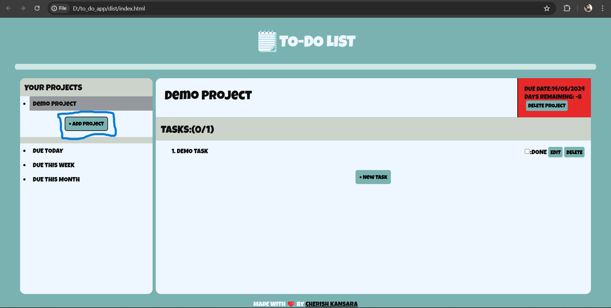
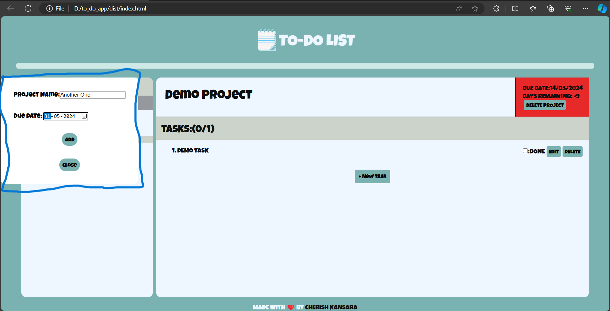
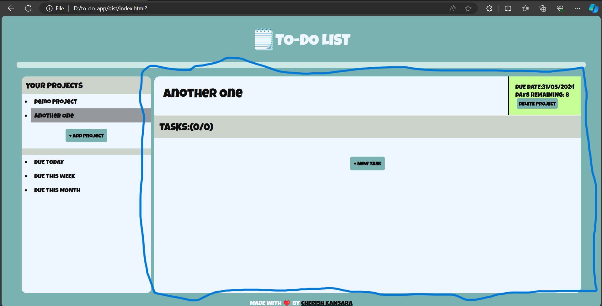
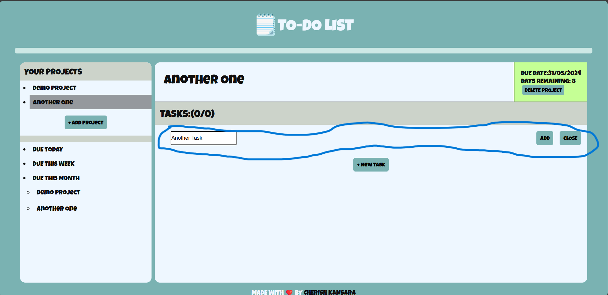
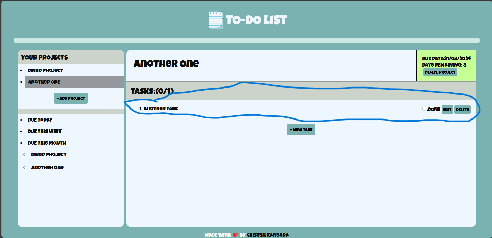

# TO-DO APP
---

It's a simple To-Do app build using Vanila CSS & JavaScript and this project is submission to TOP(The Odin Project) To-Do app solution ,This project to test one skill to handle project and splitting and managing codes through multiple files and to build 
a CRUD appliation

[Project Problem Link](https://www.theodinproject.com/lessons/node-path-javascript-todo-list)

[Solution Live Link]()

*Webpack* was used  as a bundler for this project

*LocalStorage* is used to Store data of your projects

----
## Usage

- **To Add Project**

When you will open The project For First Time a pre-built project will be there named "Demo Project",with a demo task added in it

For adding the project you have to click the new Project Button which will open a modal form in which you can enter project name and due-date

After filling the it ,you can click add to add project and if you want to cancel the operation you can click close

After adding The Project the project will be added to the Your Project list and you can open it by clicking the project name 

On opening ,on side the Project will be opened as shown above in the image and there will be the following elements

- Project Heading
>     The name of your project in this case "Another one"

- Dues Info & Delete option
>     On side of Project Heading there is a Section , Here Dues Info is Shown ,First there is due-date and below it shows how many days Remaining ,and at last there is delete project to delete project a prompt will be there to confirm delete operations 
*The color of the this section will be based on days reamaining*
*Green* : >7 days

*Gray* : <7 days

*Red* : >=0 days

- Task Section
>     This Section is used to manage Tasks in Project First There is Tasks Head in which first number shows the number of tasks done and second number shows total number of tasks and below it all tasks are shown and below it there is a add task button through which you can add task to the task list

after clicking add task further a input box will come there to add task from where you can add task,after clicking add the task will be added to your project and after adding task the task come with three options

- Done - To show if task in done and toggle it

- Edit - to edit the task of project

- Delete - to delete the project

>at last there is section below your projects which shows the due project with corresponding timeframe.

***this project may contain a lot of bugs,criticism is much appreciated***

